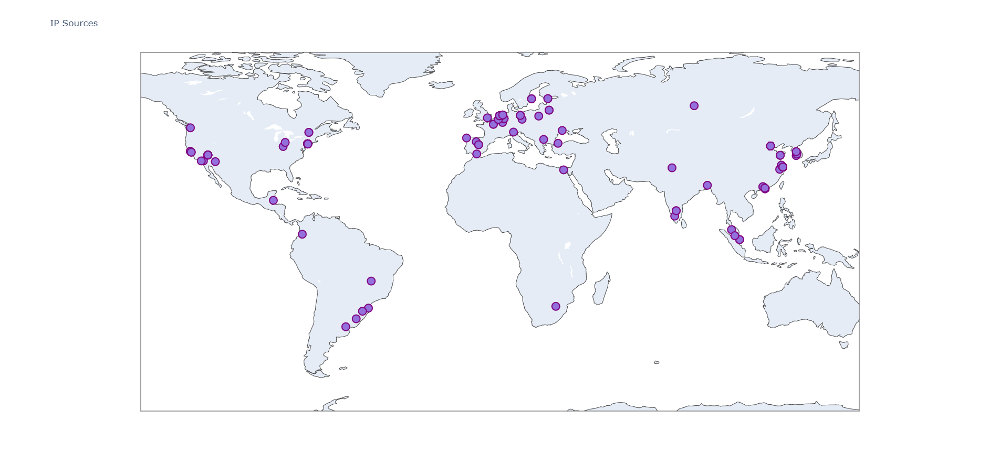

# IP Mapping Project

## Project Description:

Using the auth log from a standard ubuntu server configuration with no additional firewall configured, find out from where in the world connections to the server are being attempted and what the most common usernames are that attempt connection.

## Goals

1. Create a visualization that shows where ip addresses are coming from

2. Create a visualization that shows most common username attempts

## Where are the connections from?

### Discussion:

We can see connections are quite scattered.  This is expected given the prevalence of VPNs.  What it does tell me, from a security standpoint, is there are a lot of attempted connections that are /not/ from me / approved.  

## What are the most common user names?

### Discussion:

This did not end up as an impressive visualization, except perhaps to serve as a warning of services that commonly create admin accounts and may be exposed without being secured.

More useful are the statistics we can gather:

## The code

- [ip_mapper.py](ip_mapper.py) uses [data/ip-latlons.csv](data/ip-latlons.csv) to gather ips and their corresponding lat / lon coordinates

- 
    - Additional package: `wordcloud`
        - Installed with `pip install wordcloud`

- [ip_latlonfinder.py](ip_latlonfinder.py) uses an API (`ipinfo.io`) to trace the latitude and longitude of ip addresses.
    - Input is a csv file with `username, ip` as the format
    - Program parses for unique IP addresses
    - Program output is a `csv` placed in [data](data/ip-latlons.csv) called `ip-latlons.csv`
        - Output format: `ip, lat, lon`
    - The core code does not yet utilize pandas, but data is output in pandas friendly format

- [playground.ipynb](playground.ipynb) is a notebook that was used as a playground while deciding strategy for the project goal(s)